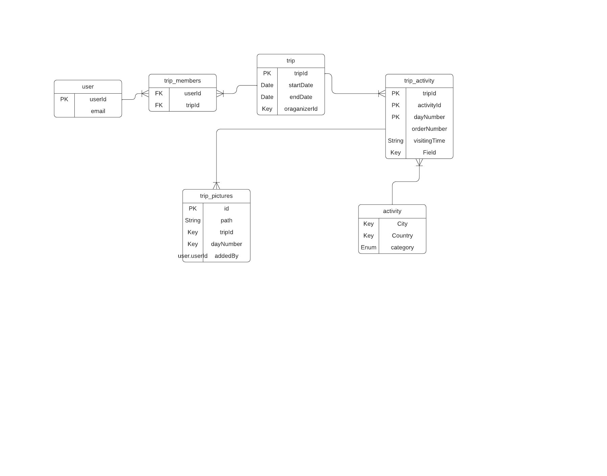

# Group Vacation Planner

The planning document can be found [here](https://docs.google.com/document/d/1p73la6_VvWuX2N0tbP8625j2QPfeewXSOQ0D_Dk-QOI/edit?usp=sharing).

- [Group Vacation Planner](#group-vacation-planner)
  - [Setting up](#setting-up)
    - [`.env` file](#env-file)
  - [Spinning up the application](#spinning-up-the-application)
    - [Start the containers](#start-the-containers)
    - [Start the `server` app](#start-the-server-app)
    - [Start the `client` app](#start-the-client-app)
  - [Tips](#tips)
    - [Modifying the DB schema](#modifying-the-db-schema)
    - [Debugging the server app](#debugging-the-server-app)
  - [UML](#uml)

## Setting up

### `.env` file

Create an `.env` file from the example file:

```bash
cp .env.example .env
```

and then fill in with your data.

---

## Spinning up the application

### Start the containers

```bash
docker-compose up
```

### Start the `server` app

*Make sure you're at the root of the project.*

```bash
cd server
npm run start:dev
```

### Start the `client` app

*Make sure you're at the root of the project.*

```bash
cd client
npm run start
```

---

## Tips

### Modifying the DB schema

In order for the changes to be reflected, run the following commands:

```bash
docker-compose down -v
```

```bash
docker-compose up
```

### Debugging the server app

1. select the proper debug profile
2. press F5

---

## UML

<div style="text-align: center;">
  
</div>